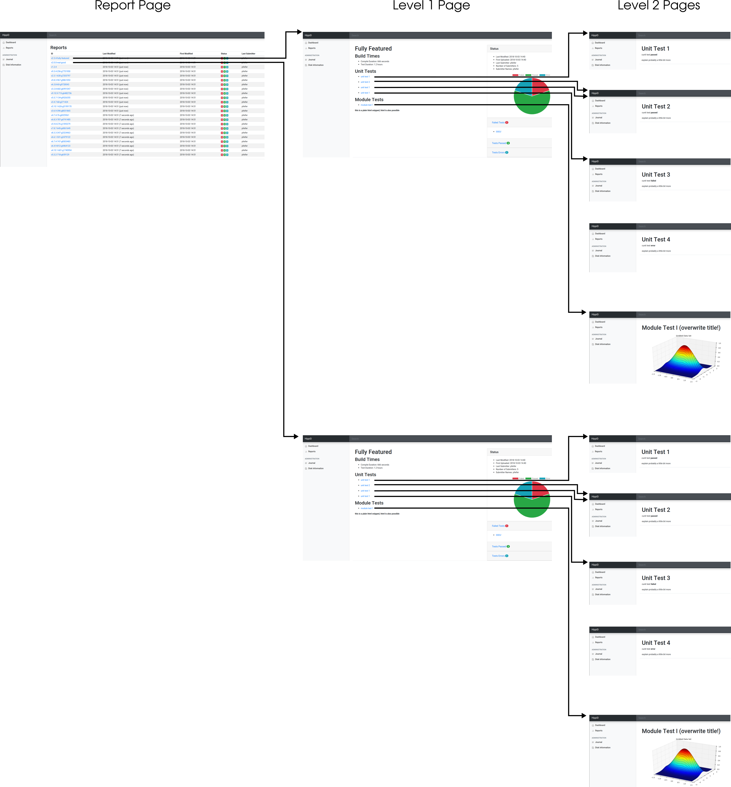

# HippiD

## Installation

```
sudo pip3 install -r requirements.txt
sudo make install
```

## Behind the Scenes

- *level 1* reflect a particular version of a software/component. This can be
	any string, but version string is probably the most sensible. E.g. `v1.2.3`,
	`v101`, `7.6.5`, `v1.2.3-23-username` or just a commit id:
	`623f905db52260a4c65aba13b49d8af8a4e31bc7`. You can put everything in this
	one page - if you want. But for test meta data you need an additional level
- *level 2* objects are the final test object. They can have test status like
	passed, failed or error.



# Exchange Data

```
{
	'major-id' : <id>
	'type' : 'major' || 'minor'
	'submitter' : <string>
	
	'meta' : {
		'lifetime-group' : 'standard' || 'reduced' || 'extended'
	}

	'data' : [
		{
			'entry' :
				{
					'name' : <filename>
					'content' : <string>
					'base64-encoded' : 'true' or 'false'
				}
		}
	]
}
```

One simple rule: data are files, always. The only exceptions are meta-data
files. These have a special meaning.

```
{
	'id' : <id>
	'submitter' : <string>
	
	'data' : [
	  # e.g. Title Object ('# FooBar')
		{
			'name' : <filename>
			'content' : <string>
		}
	  # e.g. Link Object ('[](id/foo)'
		{
			'name' : <filename>
			'content' : <string>
		}

		# e.g. Child Object within 'id' path
		{
			'type' : 'meta'
			'path' : 'sip'
			'data' : {
			 }
		}
	]
}
```

> The data model is prepared to handle more then two hierachy levels. The
> serving web-frontend on the other side not yet. This is a current limitation.
> For multilevel hierarchy the `child-id` may look like: `00110/1/2`. Within
> the data-model the hierachy is modeled by slashes. Thus `/` is not an
> ordinary identifer. All other child identifiers are allowed. To reference a
> deeply nested child element the particular entry-name must be constructed with
> slashes too. E.g. `00110/010.md`.
